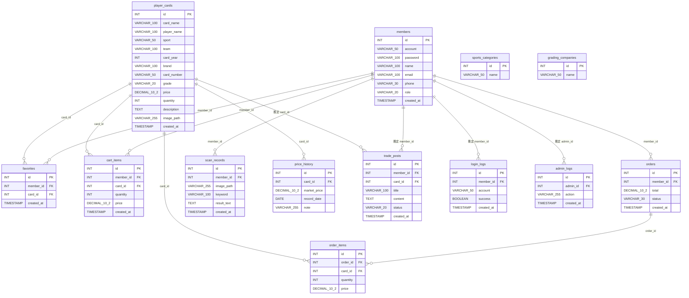

# CardArena 球員卡交易系統 ER Model

> 依據 `sql/player_card_db.sql` 與 Java `model / dao` 檔案整理。

## 補充說明

- 實線關聯：SQL 檔案中已設定 `FOREIGN KEY`。

- 虛線/推定關聯：`trade_posts.member_id`、`trade_posts.card_id`、`login_logs.member_id`、`admin_logs.admin_id` 在欄位命名上看起來應該關聯到 `members` 或 `player_cards`，但 SQL 原檔尚未加上 `FOREIGN KEY`。
